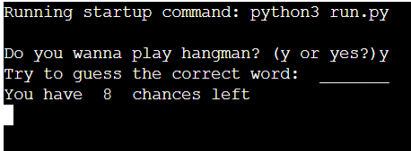

# hangman-game-python
Hangmnan is a fun and interactive game where the user plays a word-guessing game by guessing the letters of a random word generated by the computer. The user will have up to 6 chances for guseeing a wrong letter, until the visual on the screen will depict a 'hanged man' indicating you have lost the game. Coplete the word in full before your 6 chances are up and you have won the game.

## User Experience (UX)
### User Stories

* As user engaging with the application I want to be able to participate in a word game.
* As user playing the game I want the instructions to be clear.
* As user I want to interact easily with the application.
* As user I want to see my progress on a visual level.
* As a user I want to be informed when my actions/decisions were right or wrong.
* As user I want be able to play again once the game is over.

### Application Goals
* Create a words based guessing challenge for the user.
* Provide the user with an interface to input required actions for the game to be played.
* Include visuals of the user's current status within the game as they play.
* Inform the user when they have used all their chances, or if they have won the game.
* Have the user be able to answer all questions in succession.
* Let the user be able to revert back to the start if they choose play the game again.

### How to Play/Use the App
* User is greeted with a question whether they want to start the game by pressing y or yes.

   

* Message prompts user to to guess the correct randomly generated word and displays a line depicting the length of word.
  (See above image as example)

* User is given 7 chances to guess the wrong letter. On the 8th wrong guess, user loses the game.
  (See above image as example)

* Upon guessing each correct letter, they will appear in their respective position in the word.

  

* If user guesses the wrong letter, part of a picture will be displayed of a hanging man. 

   

* Each wrong guess completes the picture further.  
  (See above image as example)

* If user guesses the correct word within the designated amount of tries, they will win the game and be congratulated.
   
   
